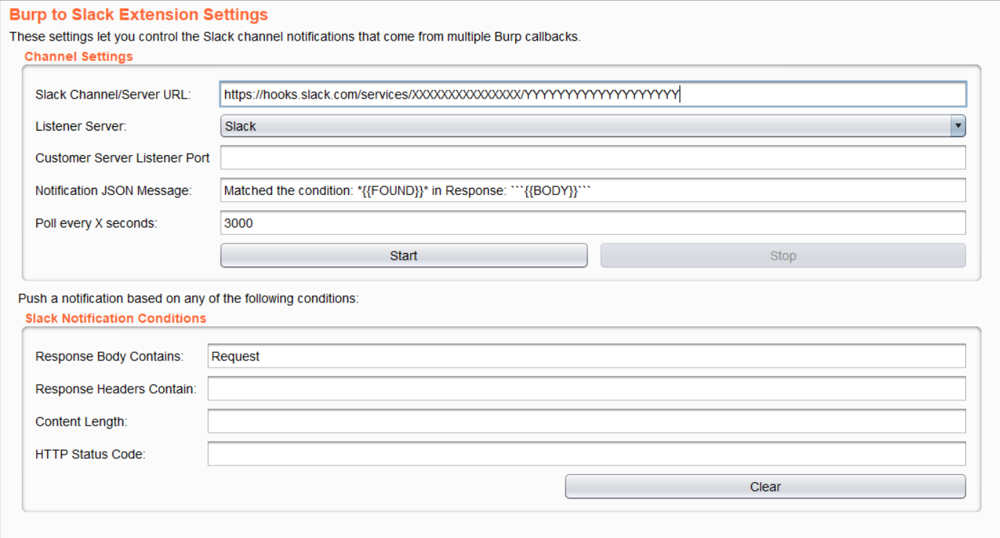

 <h3 align="center">Push notifications to Slack channel or to custom server based on BurpSuite response conditions.</h3>
 
 

### Main Features
* Poll Notifications every X seconds.
* Customize your notification using {{FOUND}} which is your input condition and {{BODY}} which returns response body.
* Match response body, HTTP headers, content length and HTTP status code.
* Use the logical operators !, =, < and > in the content length field.
* Support both Slack webhook and custom HTTP listeners.
* Match Burp proxy, Repeater, Intruder and Scanner/Spider.

#### TODO:
     - [ ] BurpCollaborator to Slack
     - [ ] Match more options 

